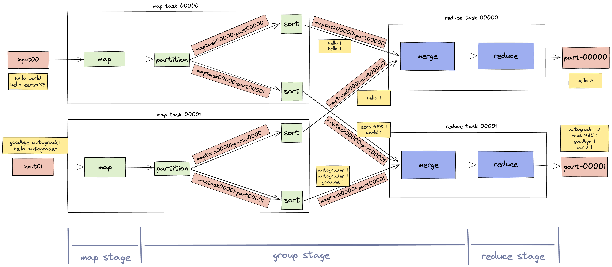

# MapReduce 

- MapReduce framework in Python inspired by Google’s original [MapReduce paper](https://static.googleusercontent.com/media/research.google.com/en//archive/mapreduce-osdi04.pdf) for EECS 485.
- Executes MapReduce programs with distributed processing on a cluster of computers like AWS EMR, Google Dataproc, or Microsoft MapReduce.
- Includes program execution, distributed systems, fault tolerance, OS-provided concurrency facilities (threads and processes), and networking (sockets).
- Consists of a Manager which listens for user-submitted MapReduce jobs and distributes the work among Workers, and multiple Worker instances that receive instructions from the Manager and execute map and reduce tasks that combine to form a MapReduce program.



## MapReduce Framework Guide

This guide provides instructions on how to set up and use AWS instances to run a MapReduce framework and submit jobs.

---

### Note: 
The following section is already completed and I have a cluster of EC2 instances running

## Prerequisites 

1. **AWS Setup**:
   - Launch AWS EC2 instances.
   - Ensure instances are properly configured with:
     - A public DNS address.
     - Attached Elastic File System (EFS).

2. **SSH Access**:
   - Ensure you have your private SSH key to access the instance securely.

3. **Required Files**:
   - Input files located in `/mnt/efs/mapreduce/input`.
   - Mapper and reducer scripts:
     - `wc_map.sh` (Word Count Mapper)
     - `wc_reduce.sh` (Word Count Reducer)

---

## Usage Instructions

### 1. Upload Input Files to the Instance (sampled uploaded)

Use the `scp` command to securely copy input files to the appropriate directory on the instance.

```
scp -r -i {YOUR_SSH_KEY} tests/testdata/input ubuntu@{PUBLIC_DNS_ADDRESS}:/mnt/efs/mapreduce/input
```

### 2. Submit a MapReduce Job

Run the mapreduce-submit command to execute a job. Below is the general syntax:

```
mapreduce-submit \
    --host {MANAGER_PUBLIC_IP_ADDRESS} \
    --port 6000 \
    --input /mnt/efs/mapreduce/input \
    --output /mnt/efs/mapreduce/output \
    --mapper /mnt/efs/mapreduce/wc_map.sh \
    --reducer /mnt/efs/mapreduce/wc_reduce.sh
```

MANAGER_PUBLIC_IP_ADDRESS: ec2-18-219-203-248.us-east-2.compute.amazonaws.com

---

## Note: 
If you would like to run your own instances to view the output from each job, the code for this project is available upon request.


